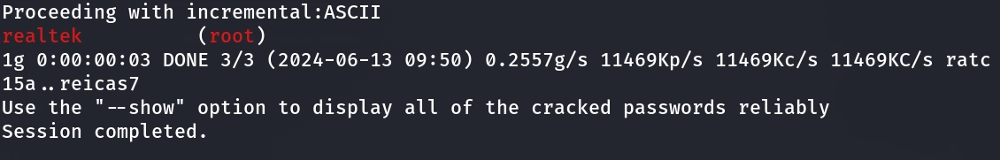

# D-Link DIR-605L v2.13B01 hardcode

### Product Information

Product: D-Link DIR-605L  Firmware Version: v2.13B01 

Manufacturer's website information：http://www.dlink.com.cn/

Firmware download address ：[https://support.dlink.com/resource/SECURITY_ADVISEMENTS/DIR-605L/REVB/DIR-605L_REVB_FIRMWARE_v2.13B01_BETA.zip](https://www.totolink.net/home/menu/detail/menu_listtpl/download/id/257/ids/36.html)

### Analysis

There is a hard code password for root in /etc/password.

The decrypted password is realtek.
