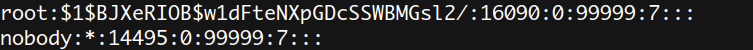

# TOTOLINK CP900L v4.1.5cu.798_B20221228 Stack Overflow

### Product Information

Product: TOTOLINK CP900L Firmware Version: v4.1.5cu.798_B20221228 Manufacturer's website information：https://www.totolink.net/ 

Firmware download address ：[TOTOLINK](https://www.totolink.net/home/menu/detail/menu_listtpl/download/id/257/ids/36.html)

### Analysis

There is a hard code password for root in /etc/shadow.sample.

The decrypted password is cs2012.

