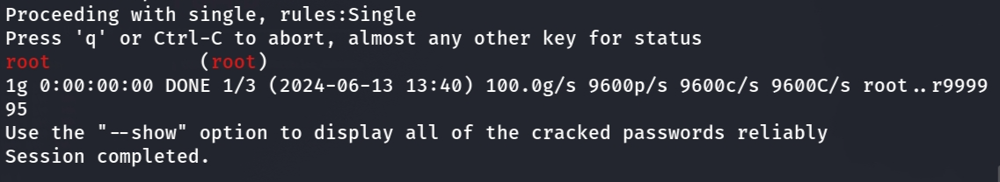

# TRENDnet TEW-814DAP v1_(FW1.01B01) was discovered to contain a hardcoded 

Product: TRENDnet TEW-814DAP Firmware Version: v1_(FW1.01B01)  

Manufacturer's website information：http://trendnet.com.cn/

Firmware download address ：[http://download.trendnet.com/](https://www.totolink.net/home/menu/detail/menu_listtpl/download/id/231/ids/36.html)

### Analysis

TRENDnet TEW-814DAP v1_(FW1.01B01) was discovered to contain a hardcoded password vulnerability in /etc/shadow.sample, which allows attackers to log in as root.

