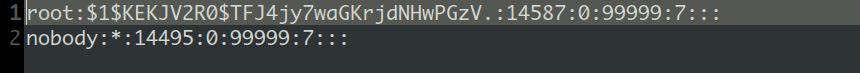

# TOTOLINK CP300 V2.0.4-B20201102  hardcode

### Product Information

Product: TOTOLINK CP300 Firmware Version: V2.0.4-B20201102   Manufacturer's website information：https://www.totolink.net/ 

Firmware download address ：https://www.totolink.net/home/menu/detail/menu_listtpl/download/id/120/ids/36.html

### Analysis

There is a hard code password for root in /etc/shadow.sample.

The decrypted password is root.

